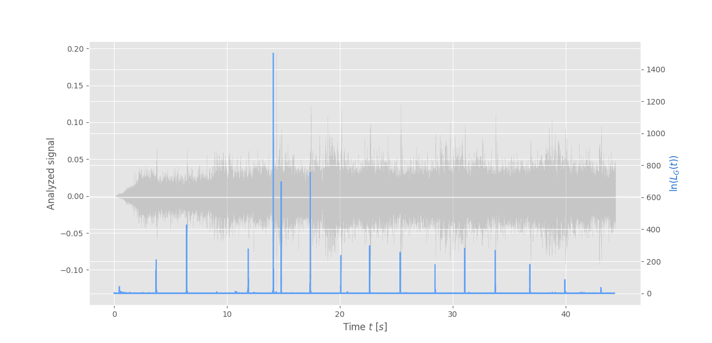
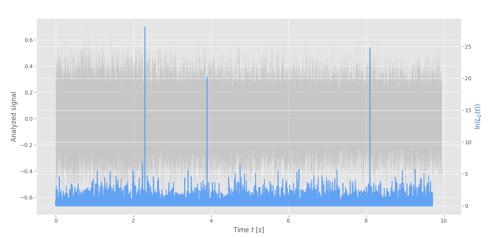

# Swainson's Thrush call detector

## Audio file formats

- File format: WAV Audio (.wav)
- Sample rate: 22050 Hz
- Encoding: 64-bit float
- Recording channel: Mono

## Results

### [Swainson's Thrush singing and calling on Youtube](https://youtu.be/0LNtk5OVssQ)

| Timestamps (seconds) |
| ------------- |
| 3.733333333   |
| 6.428571434   |
| 11.88222222   |
| 14.10095238   |
| 14.79954649   |
| 17.38671202   |
| 20.09170068   |
| 22.64671202   |
| 25.35034014   |
| 28.43201814   |
| 31.05492063   |
| 33 75854875   |
| 36.84049887   |
| 39.93392290   |

### [3 call hiden under heavy white gaussian noise](./audio_files/heavy_noise.wav)

